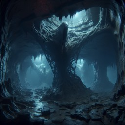

# Durn
The largest, most prosperous continent in [Nornfeld](nornfeld.md#nornfeld) mostly governed by the [Sad'aaly Empire](the-empire.md#the-sadaaly-empire).

### [Sad’aal Moran](sadaal-moran.md#sadaal-moran)
A relatively small but prosperous country located near the west coast of Durn. Mostly inhabited by elves and half elves, Sad-Moran is the heart of the empire.

### [Glenfast](glenfast.md#gelnfast)
A large country in the continent of Durn.
It’s a half-island located in the south. it's mostly inhabited by halflings, gnomes, and dwarves.
It has three main districts: [Solemnvor](glenfast.md#solemnvor), [Froste](glenfast.md#froste), [Mortmount](glenfast.md#mortmount)

---
# [Rock Hollow](rock-hollow.md#rock-hollow)

Deep underground, all throughout [Durn](#durn), there’s a vast network of caverns and tunnels, leading anywhere and everywhere around Durn. It is believed to be alive, shifting and changing without pattern. Creatures from the surface who accidentally find an entrance are rarely seen again. It is said that the caverns play tricks on your mind, beguiling you with illusions of your worst fears and deepest desires.
This network is commonly referred to as Rock Hollow, the Hollow, or, simply, the caverns.

---
# [Mythical Creatures](mythical-creatures.md#mythical-creatures)
The continent of [Durn](#durn) is full of mythical creatures that reside in certain areas. Their eternal souls are their source of life, but they can be defeated. When a mythical creature is defeated, it leaves behind an [emblem](#mythical-emblems) that encapsulates its soul until it is risen again. While in that state, it’s possible to use this emblem as a source of magic (relating to the creature’s powers and abilities). This keeps the creature at bay, preventing it from returning to its true form. That also means that if the emblem is not in steady use, the creature might rise again, and the keeper of the emblem won’t be able to use its magic until the creature is defeated once more.
Some (but not all) mythical creatures may be intelligent and capable of speech.
