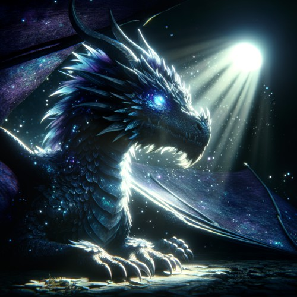

Elmersodus is a [mythical](/lore/mythical-creatures#mythical-creatures) dragon, that commands the winds, the clouds, and the skies. His eyes look like moonstone, and his hard skin is a mix of dark blue and purple.

