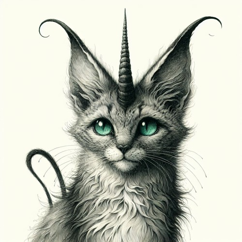

A large half-island located in the south of [Durn](/lore/durn/), mostly inhabited by dwarves. The worst battles of the [Last War](/lore/the-last-war#the-last-war) took place there, and is now one of the most strictly guarded countries in [the empire](/lore/the-empire#the-sadaaly-empire). The elves have established new order, dividing the country to three main districts: [Solemnvor](#solemnvor), [Froste](#froste), [Mortmount](#mortmount)

## Solemnvore
Referred to as 'Sullenmerr' in Dwarvish.

## Froste
Referred to as the 'Krass' in Dwarvish.

## Mortmount
Referred to as 'Otterkrest' in Dwarvish. The northern-most part of the country, Mortmount is where the land meets the ocean in the form of a tall cliff. The dwarvish citizens of this district are mostly miners, demolitionists, and metalworkers.

Due to the shape of the terrain, docks or ports could not be built and thus the inhabitants have no access to trade overseas. This has been one of the most crucial weaknesses that the Sad'aaly have exploited during the Last War and has eventually led to the empire's triumph.

#### Norven Cort

An omnivore that inhabits forests and domestic areas, commonly found in the Northern Valleys of Mortmount (or simply 'Norv' in Dwarvish). Commonly referred to as Cort.
The horns are an uncommon ingredient, which is used primarily for crafting unholy charms. Can also be ground in order to mix a variety of potions.
