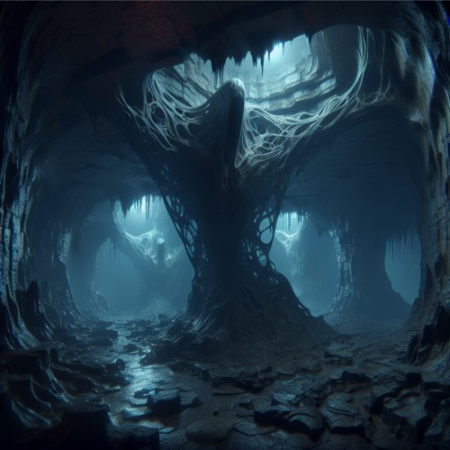

Deep underground, there’s a vast network of caverns and tunnels, leading anywhere and everywhere around [Nornfeld](/lore/nornfeld). It is believed to be alive, shifting and changing without pattern. Creatures from the surface who accidentally find an entrance are rarely seen again. It is said that the caverns play tricks on your mind, beguiling you with illusions of your worst fears and deepest desires.
This network is commonly referred to as Rock Hollow, the Hollow, or, simply, the caverns.

Subterranean creatures, as well as devotees of the [Thing](/lore/the-thing#thing-of-the-hollow), can navigate through the caverns under the [Thing's blessing](#things-blessing).

Its inhabitants include colonies of drow elves, kobolds, and other creatures of the [Underdark](https://forgottenrealms.fandom.com/wiki/Underdark) and they speak Undercommon.

### Thing's Blessing
Those under the Thing's blessing are allowed safe passage through the Hollow.
