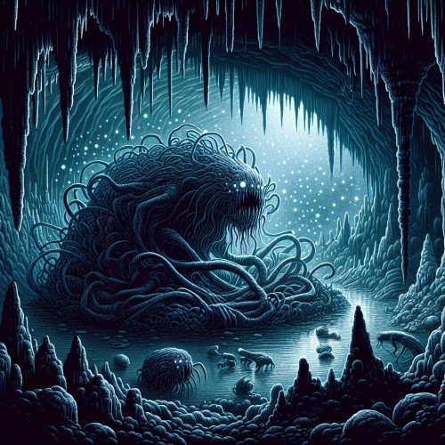

The thing is a [mythical](/lore/mythical-creatures#mythical-creatures) aberration that doesn’t speak any language, and it is believed to be itself [Rock Hollow](/lore/rock-hollow#rock-hollow). As patron of the underground, it guides its inhabitants and followers through the caverns and allows them safe passage. Trespassers and invaders are led astray until they lose their way. Some eventually manage to escape, but very often too late, as they have already been driven to insanity.

The Thing doesn’t have a consistent form, it shifts and changes its shape. It's made out of flesh, covered and infused with dirt, stone, minerals, and other things found in the Hollow. Therefore, it can appear anywhere within the caverns, at any time. It haunts any trespassers within the caverns, plaguing their minds with phantasms.

Its [heart](#the-hollow-heart) doesn't move, and is located somewhere within the caverns. Only there it can be killed, leaving behind its [locket](/items/the-locket#the-locket).

### The Hollow Heart
There is believed to be a beating heart somewhere within the caverns, which keeps the Hollow alive. It is stationary, but the caverns continually shift around it, diverting away anyone who might come near it. It is said that the closer you get to the heart of the caverns, the more convoluted and confusing the tunnels become, leading you around in circles and playing tricks on you.
