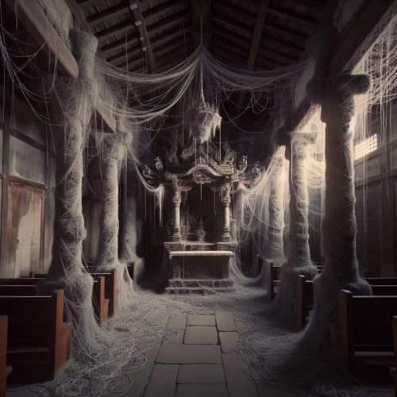
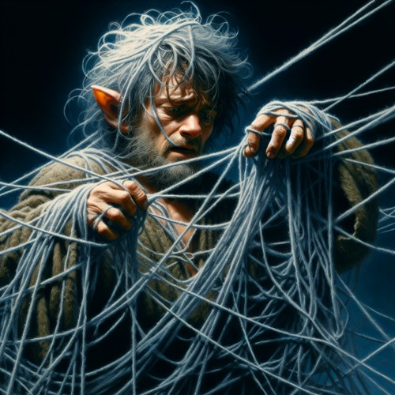

The weaver is a deity, believed to be in charge of fate, destiny, and possibility. He goes by many names; The Storyteller, Master of Myths, Weaver of Fates, He who cannot be Trusted. He is commonly depicted as a hooded figure holding a ball of yarn. The extent of his powers is yet to be understood, as his intentions are ever unclear. It is said that the weaver's will is never predictable. He plays with the fate of those he chooses, showering them with gifts, bestowing curses upon them, and sending very confusing message. Some believe that there is a lesson he is trying to teach them, while others believe that this is his way to keep himself amused.

Any attempts to please him don't tend to be fruitful, and attempts to defy him often end up inconsequential. It is seemingly impossible to gain his neither favor nor his contempt, to affect his choices, or to alter courses of fate that he has already set.

# Weaver's Yarn
The weaver chooses certain people to provide guidance for. They are commonly referred to as 'chosen ones', 'puppets', or 'pawns'. He marks his message with [lone strands of yarn](/items/weavers-yarn/) that he leaves in odd places, wrapped around particular objects that may or may not hold special meaning to the recipient. He never speaks with words, yarn is his only way of communicating with mortals.

He attempts to direct and guide his pawns on a certain path, which sometimes leads to fortune. Other times, it leads them to a terrible disaster. Although, it does not always make for an interesting story. In fact it can very often be quite underwhelming. Therefore, the weaver is as equally fond of those who follow his guidance as he is of those who don't. It is unknown how or why he chooses his pawns, and whether it is better to be chosen or not. Regardless, the chosen ones are forever subjected to his messages and guidance, whether they decide to do his bidding or not.

# Temple of Fates
His followers are called The Faithless, because it is strongly inadvisable to have faith in the weaver. As a matter of fact, it is unclear why he has any followers at all. They do not provide an explanation for their allegiance, but they seem to fit them well. Many of them are not pawns of the weaver, and neither do they wish to be. Those of them who are chosen are not regarded as superior nor inferior to those who aren't, and don't take pride nor shame in being chosen. The faithless generally have a stoic aura about them, a radical acceptance of the strange ways of their deity and of the world as a whole. They dress as the weaver is depicted, in hooded brown rags, and lead a solitary lifestyle as hermits. They reside in abandoned temples of other deities, which have been reclaimed by the weaver as Temples of Fate. There are generally no more than one or two followers per temple.

When the faithless find an abandoned temple they wish to reclaim, they bring a bit of yarn into it, allowing it to take hold. The yarn magically extends far beyond its initial length, wrapping itself around poles, chairs, chandeliers, and the like. The yarn in a temple of fates is not imbued with magic, but the weaver can move and tangle it in any way he sees fit. The more yarn there is, the more potent his magic becomes, heightening his presence.

# Whim of the Weaver
In the weaver's temples, he is able to send those he choises on what is referred to as a Whim. The yarn in will wrap itself around a pawn, gently at first, until he or she is engulfed completely. Should the pawn resist, the yarn becomes aggressive, swiftly restraining him. The pawn then disappears and is sent to a pocket dimension, perhaps never to return, and his fate now lies solely in the hands of the weaver. Those who manage to come back report of differing experiences, some pleasant, some unspeakably gruesome. The whim always relates to the pawn's own unique weaknesses, fears, hidden desires, and falsities. Some view it as the weaver's way of ensuring justice, while others view it as a cruel, sadistic game.

