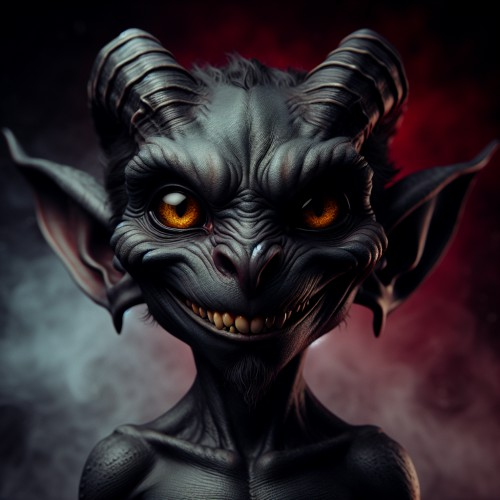

> “We're not the exception, but the rule.
>
> The rivers upon which bridges are built, the ale you pour down your gullet,
>
> the everlasting hunger, the endless whispers, the pain,
>
> the reflection in the mirror, the monsters in your bed,
>
> the screeching, the thirst, the shiver down your spine.
>
> Whatever you do, wherever you go, whomever you meet,
>
> we are all there is.”
>
> — Unknown, unimportant

## Hellish Creatures
Triflings are derived from bloodlines of tieflings mixed with halflings, dwarves, and gnomes. They have large horns that take any of a variety of shapes: some have curling horns like a ram, others have straight and tall horns like a gazelle's, and some spiral upward like an antelopes' horns. They have slim tails, two to three feet long, which lash or coil around their legs when they get upset or nervous. Their ears are pointed, their canine teeth are sharp, and their eyes are solid colors—black, red, white, silver, or gold—with no visible sclera or pupil. Their skin tones cover the full range of human coloration, but also include various shades of red. Their hair, cascading down from behind their horns, is usually dark, from black or brown to dark red, blue, or purple.

## Shunned by Society
Heavily resembling imps in their appearance, triflings subsist in small minorities found mostly in the outskirts of human cities or towns, often in the roughest quarters of those places. Sometimes they live among other minority populations in enclaves where they are treated with less hostility.

Lacking in physical strength, triflings must rely on their cunning guile and quick reflexes to survive. They are commonly mistaken for imps, greeted with suspicion and even hostility. They find it difficult to gain the trust of others, and so they begin to embrace others' prejudice against them, using their devilish appearance for their advantage.

> ##### MET WITH HATE
>
> Many people tend to be hostile towards triflings, naturally regarding them as monsters. Therefore, their presence is not always welcome in most cities, and they often must be discreet about their appearance and identity. It's also recommended for them to stay away from main roads and trade routes in order to avoid undesirable encounters.

## Lesser Tiefling Traits
Triflings share certain racial traits as a result of their infernal bloodline.

### Ability Score Increase
Your Dexterity score increases by 2 and your Charisma score increases by 1.

### Age
Triflings can live for hundreds of years, and don't have much of a grasp on maturity or elders. Some live for a mere century, some for eons.

### Size
Triflings are about the same size and build as goblins. Your size is Small.

### Speed
Your base walking speed is 30 feet.

### Darkvision
Thanks to your infernal bloodline, you have superior vision in dark and dim conditions. You can see in dim light within 60 feet of you as if it were bright light, and in darkness as if it were dim light. You can’t discern color in darkness, only shades of gray.

### Infernal Invocations
You know the produce flame cantrip. When you reach 3rd level, you can cast the disguise self spell with this trait a number of times equal to your proficiency bonus. When you reach 5th level, you can cast the invisibility spell with this trait a number of times equal to your proficiency bonus. Charisma is your spellcasting ability for these spells, and you regain all expended uses when you finish a long rest.

### The Meek Shall Inherit
Living a life of constant danger and faced with hostility from all sides, you've adapted to accommodate for your weakness. Your Strength score is reduced by 1 point, but you can choose a feat.

### Languages
You can speak, read, and write Common and Infernal.
