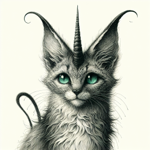

# Glenfast
A large country in the continent of [Durn](durn.md#durn).
It’s a half-island located in the south. it's mostly inhabited by halflings, gnomes, and dwarves.
It has three main districts: [Solemnvor](#solemnvor), [Froste](#froste), [Mortmount](#mortmount)

## Solemnvor

## Froste

## Mortmount

#### Norven Cort

An omnivore that inhabits forests and domestic areas, commonly found in the Northern Valleys of Mortmount (or simply 'Norv' in Dwarvish). Commonly referred to as Cort.
The horns are an uncommon ingredient, which is used primarily for crafting unholy charms. Can also be ground in order to mix a variety of potions.
