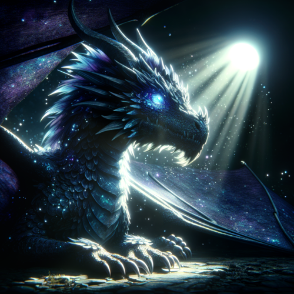
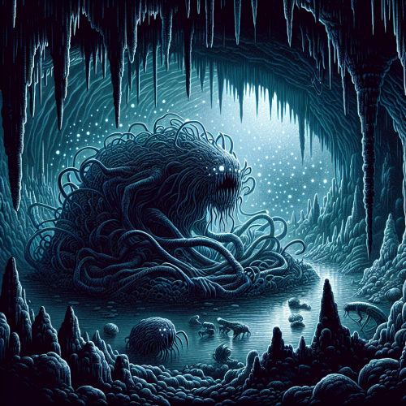
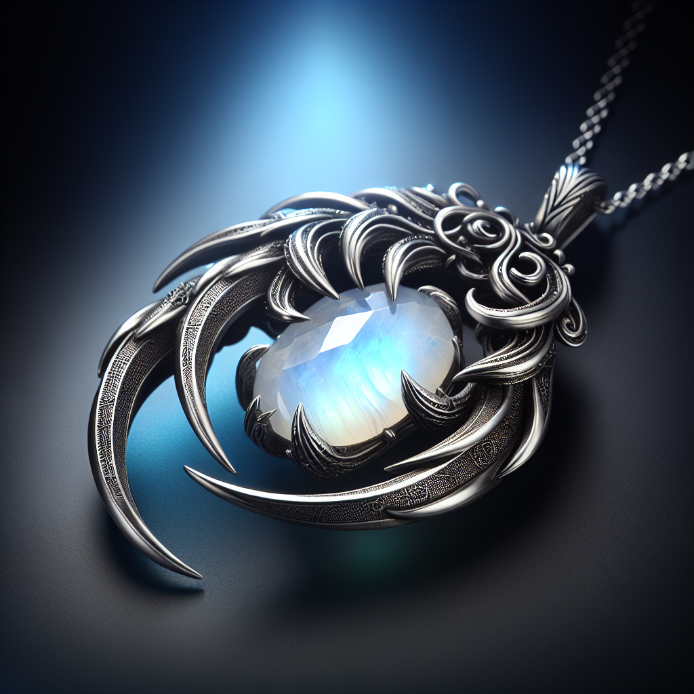
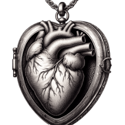

# Mythical Creatures
The continent of [Durn](durn.md#durn) is full of mythical creatures that reside in certain areas. Their eternal souls are their source of life, but they can be defeated. When a mythical creature is defeated, it leaves behind an [emblem](#mythical-emblems) that encapsulates its soul until it is risen again. While in that state, it’s possible to use this emblem as a source of magic (relating to the creature’s powers and abilities). This keeps the creature at bay, preventing it from returning to its true form. That also means that if the emblem is not in steady use, the creature might rise again, and the keeper of the emblem won’t be able to use its magic until the creature is defeated once more.
Some (but not all) mythical creatures may be intelligent and capable of speech.

---

#### [Elmersodus, the Nocturnal Sentinel](the-nocturnal-pact.md#elmersodus-the-nocturnal-sentinel)

Elmersodus is a powerful dragon that inhabits the land and skies. His powers affect the night sky, painting them as he sees fit. At night, he can also control the weather, the behavior of clouds and the intensity of starlight. He can see anything that’s touched by moonlight, and hear any sound the wind carries to him.
- [Amulet of the Sentinel](#amulet-of-the-sentinel)

#### [Thing of the Hollow](rock-hollow.md#thing-of-the-hollow)

Patron of the underground, the Thing is believed to be itself [Rock Hollow](rock-hollow.md#rock-hollow). It doesn’t have a consistent form, it shifts and changes its shape. It's made out of flesh, covered and infused with dirt, stone, minerals, and other things found in the Hollow.
- [The Locket](#the-locket)

---

# Mythical Emblems
When a [mythical creature](#mythical-creatures) is defeated it leaves behind a powerful emblem of some kind, which grants its holder access to this creature's mythical powers. Unless the emblem is in steady use, the creature will eventually rise again.

---

#### [Amulet of the Sentinel](../items/sentinel-amulet.md#amulet-of-the-sentinel)

A magical amulet that holds the resting soul of the [Sentinel](#elmersodus-the-nocturnal-sentinel), after he is defeated. When a spell caster attunes to this item, they have the powers of Elmersodus, using it as an arcane focus.

#### [The Locket](../items/the-locket.md#the-locket)

Locket of the [Thing](#thing-of-the-hollow).
