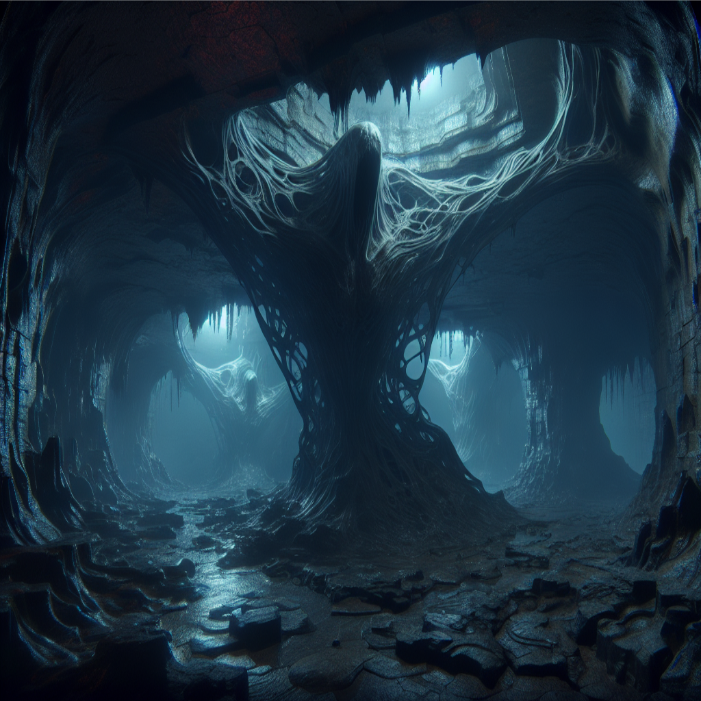

<title>Rock Hollow</title>

# Rock Hollow

Deep underground, all throughout [Durn](durn.md#durn), there’s a vast network of caverns and tunnels, leading anywhere and everywhere around Durn. It is believed to be alive, shifting and changing without pattern. Creatures from the surface who accidentally find an entrance are rarely seen again. It is said that the caverns play tricks on your mind, beguiling you with illusions of your worst fears and deepest desires.
This network is commonly referred to as Rock Hollow, the Hollow, or, simply, the caverns.

Subterranean creatures, as well as devotees of the [Thing](#thing-of-the-hollow), can navigate through the caverns under the [Thing's blessing](#things-blessing).

Its inhabitants include colonies of drow elves, kobolds, and other creatures of the [Underdark](https://forgottenrealms.fandom.com/wiki/Underdark) and they speak Undercommon.

### Thing's Blessing
Those under the Thing's blessing are allowed safe passage through the Hollow.

---

# Thing of the Hollow

Thing of the Hollow is a [mythical aberration](mythical-creatures.md#mythical-creatures) that doesn’t speak any language, and it is believed to be itself [Rock Hollow](#rock-hollow). As patron of the underground, it guides its inhabitants and followers through the caverns and allows them safe passage. Trespassers and invaders are led astray until they lose their way. Some eventually manage to escape, but very often too late, as they have already been driven to insanity.

The Thing doesn’t have a consistent form, it shifts and changes its shape. It's made out of flesh, covered and infused with dirt, stone, minerals, and other things found in the Hollow. Therefore, it can appear anywhere within the caverns, at any time. It haunts any trespassers within the caverns, plaguing their minds with phantasms.

Its [heart](#the-hollow-heart) doesn't move, and is located somewhere within the caverns. Only there it can be killed, leaving behind its [locket](#the-locket).

### The Hollow Heart
There is believed to be a beating heart somewhere within the caverns, which keeps the Hollow alive. It is stationary, but the caverns continually shift around it, diverting away anyone who might come near it. It is said that the closer you get to the heart of the caverns, the more convoluted and confusing the tunnels become, leading you around in circles and playing tricks on you.
