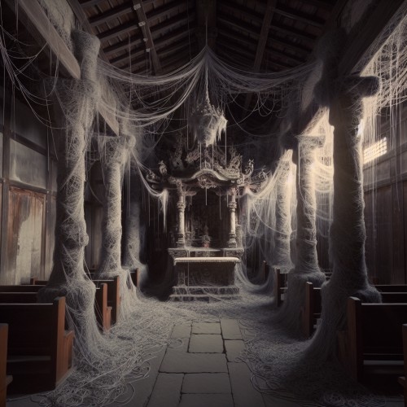

# The Weaver

He goes by many names; The Storyteller, Master of Myths, Weaver of Fates, He who cannot be Trusted. The weaver is a deity, believed to be in charge of fate, destiny, and possibility. He is commonly depicted as a hooded figure holding a ball of yarn. The extent of his powers is yet to be understood, as his intentions are ever unclear. It is said that the weaver's will is never predictable. He plays with the fate of those he chooses, showering them with gifts, bestowing curses upon them, and sending very confusing message. Some believe that there is a lesson he is trying to teach them, while others believe that this is his way to keep himself amused.

Any attempts to please him don't tend to be fruitful, and attempts to defy him often end up inconsequential. It is seemingly impossible to gain his neither favor nor his contempt, to affect his choices, or to alter courses of fate that he has already set.

## Weaver's Yarn
The weaver chooses certain people to provide guidance for. They are commonly referred to as 'chosen ones', 'puppets', or 'pawns'. He marks his message with [lone strands of yarn](../items/weavers-yarn.md#yarn) that find their way to odd places, wrapped around particular objects that may or may not hold special meaning to the recipient. He never speaks with words, yarn being his only tool of communication.

He attempts to direct and guide the recipient on a certain path, which is as likely to be profitable as it is to be detrimental. It does not always make for a great story, either. In fact, it is often very underwhelming. He is as equally fond of those who follow his guidance as he is of those who don't. It is unknown how or why he chooses his pawns, and whether it is better not to be chosen. Regardless, the chosen ones are forever subjected to his whimsical messages, whether they decide to do his bidding or not.

## Temple of Fates
His followers are called 'The Faithless', because it is inadvisable to have faith in the weaver. It's unclear why he has any followers at all, as they do not provide an explanation for it. Many of them are not chosen by the weaver, and neither do they wish to be. Those of them who are chosen are not regarded as superior to those who aren't, and don't take pride in being chosen. The faithless are generally carry a stoic aura about them, a radical acceptance of the strange ways of their deity and of the world as a whole. They dress as the weaver is depicted, in hooded brown rags, and stay in abandoned temples of other deities.

When followers find an abandoned temple they bring a ball of yarn into it, allowing it to take hold. The yarn magically extends and wraps itself around poles, chairs, equipment, and the like, establishing a temple of fates. This is where they usually reside, generally no more than one or two followers per temple. They lead a solitary lifestyle as hermits. The yarn in a temple of fates is not imbued with magic, but the weaver can move and tangle it in any way he sees fit.

## Whim of the Weaver
When certain people enter his temple, the weaver may decide to send them on what is referred to as a 'Whim of the Weaver'. The yarn in the temple will wrap itself around the chosen pawn, gently at first, until he or she is covered completely. Should the pawn resist, the yarn becomes aggressive, swiftly engulfing and restraining him. The pawn then disappears and is sent to a pocket dimension, perhaps never to return, and his fate now lies solely in the hands of the weaver. Those who manage to come back report of differing experiences, some pleasant, some unspeakably gruesome. The whim always relates to the pawn's own unique weaknesses, fears, hidden desires, and falsities. Some view it as the weaver's way of ensuring justice, while others view it as another of his cruel, sadistic games.

